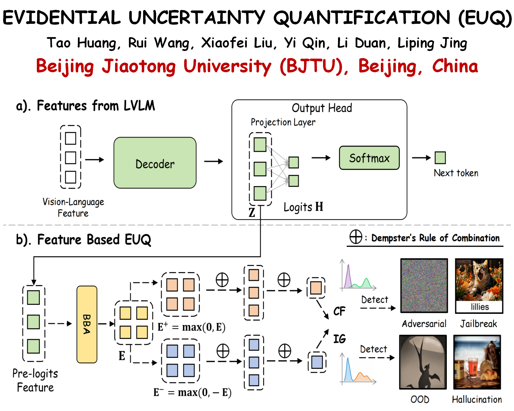

<!-- # 📝 Publications -->
## ⭐ Selected Publications

  

    

      
ICLR 2026

      
    

  

  

 [**Detecting Misbehaviors of Large Vision-Language Models by Evidential Uncertainty Quantification**](https://openreview.net/forum?id=xJT4fXJr1Q) 

 **Tao Huang**, Rui Wang, Xiaofei Liu, Yi Qin, Li Duan, Liping Jing; | [📦**Code**](https://github.com/HT86159/EUQ) | [🤗**Huggingface**](https://huggingface.co/datasets/TerryHWong/Misbehavior-Bench)  

**Efficient Framework**: A training-free method that quantifies uncertainty using pre-logits features in a single forward pass.

**Novel Insight**: Layer-wise dynamic analysis reveals hallucinations correspond to high internal conflict, while OOD failures correspond to high ignorance.

**Superior Performance**: Outperforms strong baselines on four state-of-the-art LVLMs, improving AUROC by **10.4%** and AUPR by **5.3%** on average.

  

